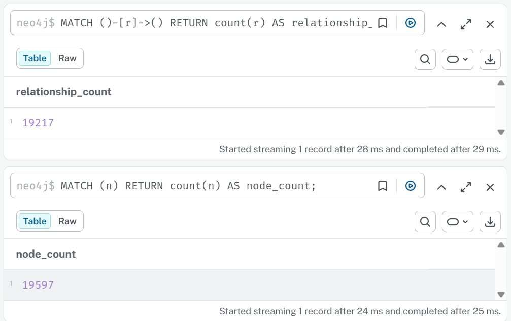
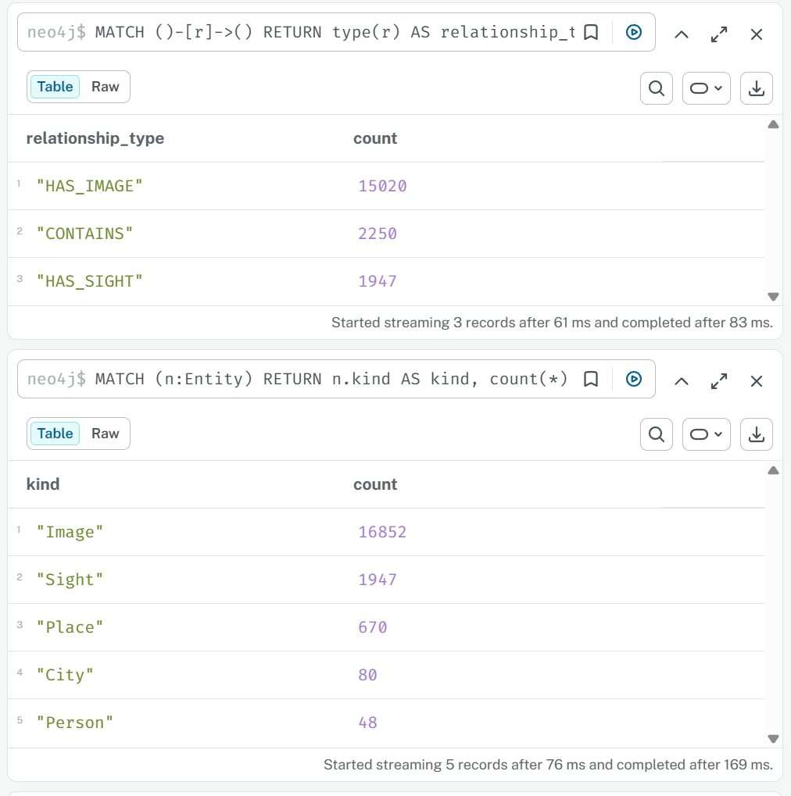
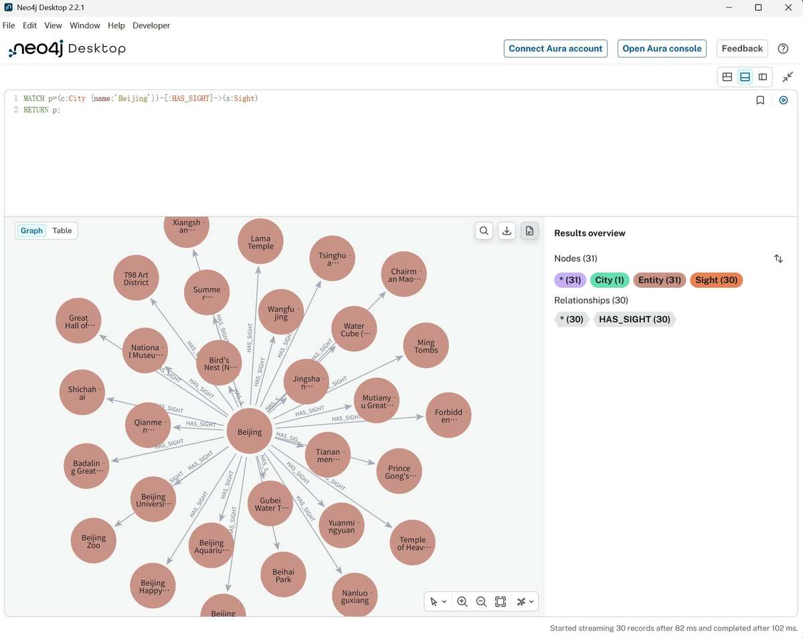
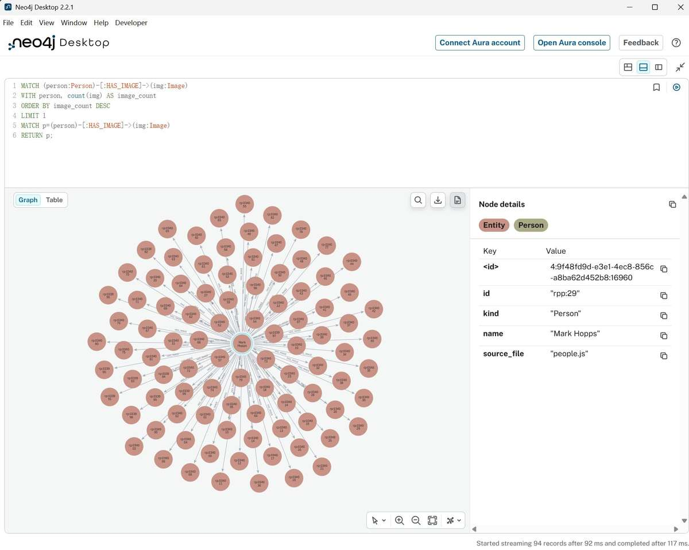
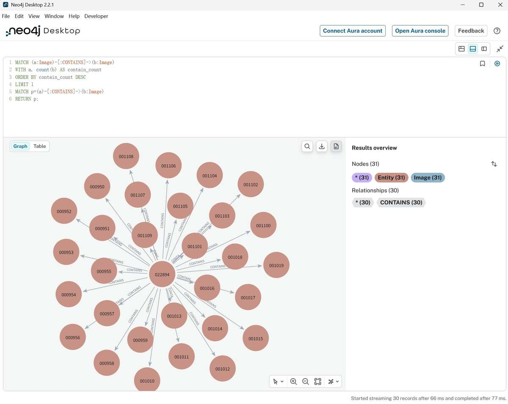

# 基于 Neo4j 的 OpenRichpedia 多模态知识图谱可视化实验报告

## 摘要

本实验选取 OpenKG 开放知识图谱生态中的 OpenRichpedia 数据资源作为实验对象。OpenRichpedia 是包含文本实体与视觉资源关联的多模态知识图谱。实验首先分析其城市、景点、人物与图片等数据结构，随后使用 Python 对原始数据进行格式解析、实体 ID 规范化、节点合并及关系去重，将异构源数据统一转换为节点表和关系表。之后采用 Neo4j 图数据库建立实体节点及 `HAS_SIGHT`、`HAS_IMAGE`、`CONTAINS` 三类关系，并利用 Cypher 完成规模统计、类型分布分析、局部子图查询和知识图谱可视化。最终成功导入 19,597 个节点与 19,217 条关系。实验结果表明，图数据库能够自然表达实体之间的语义关联，且 OpenRichpedia 数据具有显著的视觉资源占比和多模态特征。

**关键词：** 知识图谱；OpenRichpedia；Neo4j；Cypher；多模态知识图谱；数据可视化

## 1. 实验目的

1. 理解知识图谱中实体、关系和属性的基本含义；
2. 学习将开放知识图谱数据转换为图数据库可接受的结构；
3. 掌握 Neo4j 中节点、关系、标签、属性与唯一约束的基本用法；
4. 掌握 `MATCH`、`MERGE`、`RETURN`、`WITH` 等基础 Cypher 查询；
5. 使用 Neo4j 图视图完成知识图谱可视化，并对查询结果进行分析。

## 2. 数据集介绍

### 2.1 数据来源

数据来源于 OpenKG-ORG 发布的 OpenRichpedia GitHub 仓库：

<https://github.com/OpenKG-ORG/OpenRichpedia>

为了保证实验可复现，本实验固定使用提交：

```text
0ded4b2c9414160b5b39914d43e42168e4d0762c
```

OpenRichpedia 原项目采用 CC BY 4.0 许可证，本实验在代码与报告中保留数据来源信息。

### 2.2 数据特点

普通知识图谱主要描述文本实体之间的语义关系，而 OpenRichpedia 将知识图谱实体与图片等视觉资源建立联系，因此具有明显的多模态特征。本实验选择其中城市与景点、地点与图片、人物与图片及图片实体之间的关系作为课程实验子集。

实际使用的主要数据文件包括 `city.js`、`city_sight.js`、`pic_city.js`、`people.js`、`pic_people.js` 与 `contain.js`。

## 3. 知识图谱模型设计

### 3.1 图模型

将实验知识图谱表示为：

$$
G=(V,E)
$$

其中节点集合为：

$$
V=V_{city}\cup V_{sight}\cup V_{place}\cup V_{person}\cup V_{image}
$$

关系集合为：

$$
E=E_{has\_sight}\cup E_{has\_image}\cup E_{contains}
$$

### 3.2 节点类型

| 节点类型 | 说明 | 典型属性 |
|---|---|---|
| `City` | 城市实体 | `id`, `name`, `source_file` |
| `Sight` | 景点实体 | `id`, `name`, `source_file` |
| `Place` | 一般地点实体 | `id`, `name`, `source_file` |
| `Person` | 人物实体 | `id`, `name`, `source_file` |
| `Image` | 图片/视觉实体 | `id`, `name`, `source_file` |

### 3.3 关系类型

| 关系 | 语义 |
|---|---|
| `HAS_SIGHT` | 城市包含或关联一个景点 |
| `HAS_IMAGE` | 人物或地点实体关联视觉资源 |
| `CONTAINS` | 图片实体之间的包含关联 |

## 4. 数据预处理

### 4.1 原始数据问题

原始数据来自多个 JavaScript/JSON 风格文件，存在字段风格不同、ID 命名空间不统一等问题。例如 Wikidata 实体可能同时表示为 `Q956` 和 `wd:Q956`，若直接导入将产生重复实体。

### 4.2 ID 规范化

对裸 Wikidata QID 采用：

$$
f(Q_i)=wd:Q_i
$$

因此 `Q956` 被统一成 `wd:Q956`。已有命名空间的 `rpp:*`、`rp:*` 以及完整 URI 保留原值。城市图片使用 `img-city:` 前缀避免与普通实体 ID 冲突。

### 4.3 节点合并与关系去重

同一 ID 来自多个数据源时采用节点类型优先级：

```text
City > Sight > Person > Place > Image
```

关系以：

$$
(source\_id,type,target\_id)
$$

作为去重键。

### 4.4 数据质量验证

预处理程序检查节点 ID 唯一性、关系端点完整性以及节点/关系类型白名单。正式运行中，验证程序输出：

```text
验证通过：19597 个节点，19217 条关系。
```

说明生成的节点 ID 无重复，关系类型均在白名单中，且不存在指向缺失节点的悬空关系。

## 5. Neo4j 数据库实现

### 5.1 实验环境

本次正式实验实际运行环境如下：

- 操作系统：Windows；
- Python：3.10；
- Neo4j Desktop：2.2.1；
- Neo4j 实例版本：2026.07.1；
- Neo4j Python Driver：6.3.0；
- 数据预处理程序：本仓库 `src/openrichpedia_kg/` 与 `scripts/`。

### 5.2 唯一约束

```cypher
CREATE CONSTRAINT entity_id_unique IF NOT EXISTS
FOR (n:Entity) REQUIRE n.id IS UNIQUE;
```

该约束保证所有知识实体均通过 `id` 唯一标识。

### 5.3 数据导入

节点使用统一 `:Entity` 标签并附加具体类别标签；关系根据白名单分三类导入。导入采用 `MERGE` 而不是无条件 `CREATE`，因此重复执行不会不断创建相同节点和关系。

正式导入完成后程序输出：

```text
导入完成：19597 个节点，19217 条关系。
```

## 6. 实验结果与可视化

### 6.1 数据规模验证

Neo4j 中执行：

```cypher
MATCH (n)
RETURN count(n) AS node_count;
```

```cypher
MATCH ()-[r]->()
RETURN count(r) AS relationship_count;
```

得到：

$$
|V|=19597
$$

$$
|E|=19217
$$

查询结果与 Python 预处理阶段的统计完全一致，说明节点与关系已完整导入 Neo4j。



**图 1  Neo4j 节点与关系数量验证。**

### 6.2 节点类型与关系类型分布

节点类型统计结果如下：

| 节点类型 | 数量 |
|---|---:|
| `Image` | 16,852 |
| `Sight` | 1,947 |
| `Place` | 670 |
| `City` | 80 |
| `Person` | 48 |
| **合计** | **19,597** |

关系类型统计结果如下：

| 关系类型 | 数量 |
|---|---:|
| `HAS_IMAGE` | 15,020 |
| `CONTAINS` | 2,250 |
| `HAS_SIGHT` | 1,947 |
| **合计** | **19,217** |



**图 2  节点类型与关系类型分布。**

从数量上看，Image 节点占全部节点的比例为：

$$
P_{Image}=\frac{16852}{19597}\times 100\%\approx 85.99\%
$$

`HAS_IMAGE` 关系占全部关系的比例为：

$$
P_{HAS\_IMAGE}=\frac{15020}{19217}\times 100\%\approx 78.16\%
$$

因此，本实验数据中视觉实体与视觉关联占据绝对多数，这从定量上体现了 OpenRichpedia 的多模态知识图谱特征。

### 6.3 城市—景点关系可视化

执行：

```cypher
MATCH p=(c:City {name:'Beijing'})-[:HAS_SIGHT]->(s:Sight)
RETURN p;
```

查询得到 1 个 `City` 节点、30 个 `Sight` 节点和 30 条 `HAS_SIGHT` 关系。



**图 3  Beijing 与景点实体的 `HAS_SIGHT` 关系可视化。**

由图可见，城市节点 Beijing 位于局部子图中心，通过 `HAS_SIGHT` 有向关系连接 30 个景点实体，包括 Temple of Heaven、Beihai Park、Beijing Zoo 等。图结构能够直接表现“一个城市关联多个景点”的一对多语义关系，比二维表更加直观。

### 6.4 人物—图片多模态关系

为了获得更集中且具有代表性的局部图，先统计每个人物关联的图片数量，并选择 `HAS_IMAGE` 关系最多的人物：

```cypher
MATCH (person:Person)-[:HAS_IMAGE]->(img:Image)
WITH person, count(img) AS image_count
ORDER BY image_count DESC
LIMIT 1
MATCH p=(person)-[:HAS_IMAGE]->(img:Image)
RETURN p;
```

查询结果显示人物 **Mark Hopps** 为该数据子集中关联图片数量最多的人物之一，本次查询返回 94 条人物—图片路径。



**图 4  Mark Hopps 与图片实体的 `HAS_IMAGE` 多模态关系可视化。**

图中人物实体作为中心节点，通过 `HAS_IMAGE` 关系连接大量 Image 节点。该结果体现了 OpenRichpedia 的多模态特点：人物不只具有文本语义信息，还能够通过显式关系与视觉资源建立结构化联系。

### 6.5 图片实体 `CONTAINS` 关系

为了避免随机截取关系造成多个分散子图，首先寻找 `CONTAINS` 出边最多的 Image 节点：

```cypher
MATCH (a:Image)-[:CONTAINS]->(b:Image)
WITH a, count(b) AS contain_count
ORDER BY contain_count DESC
LIMIT 1
MATCH p=(a)-[:CONTAINS]->(b:Image)
RETURN p;
```

查询得到以 Image `022894` 为中心的局部子图，共包含 31 个 Image 节点与 30 条 `CONTAINS` 关系。



**图 5  Image `022894` 与其他图片实体之间的 `CONTAINS` 关系可视化。**

该结果说明 OpenRichpedia 不仅保存文本实体与视觉资源之间的映射，还保存视觉资源内部的结构化关系。Neo4j 可以直接将这种图片间的关联表示为有向边，从而形成可查询和可视化的视觉知识子图。

## 7. 实验分析

本实验中的主要困难并不是 Cypher 语法本身，而是如何将异构开放数据转换成一致的图模型。若不统一实体 ID，同一 Wikidata 实体可能被重复创建；若不检查关系端点，则可能产生无法正确匹配的关系。因此，数据预处理和完整性验证是将开放知识图谱导入数据库的重要步骤。

从实验结果看，本数据集中约 $85.99\%$ 的节点属于 Image 类型，约 $78.16\%$ 的关系属于 `HAS_IMAGE`。这说明本实验并非简单的城市—景点知识图谱，而是具有显著视觉资源特征的多模态知识图谱。Beijing 的 30 条 `HAS_SIGHT` 关系展示了传统语义知识关联；Mark Hopps 与大量 Image 节点的联系展示了文本人物实体与视觉资源之间的跨模态连接；Image `022894` 的 30 条 `CONTAINS` 关系则展示了视觉实体之间的内部结构。

Neo4j 的优势在于它将实体直接存储为节点、语义联系直接存储为关系。当需要查询一个实体的邻居或多跳路径时，图数据库的表达方式比关系型表连接更接近知识图谱本身，同时 Graph 视图能够直接将查询结果转换为可解释的网络结构。

## 8. 实验总结

通过本实验，完成了从 OpenRichpedia 开放知识图谱数据到 Neo4j 图数据库的完整流程，包括数据源分析、格式解析、ID 规范化、节点与关系建模、数据质量验证、批量导入、Cypher 查询和图谱可视化。最终构建的实验图谱包含 19,597 个节点与 19,217 条关系，并通过 Neo4j 查询验证了数据库中的数据规模与预处理结果完全一致。

本实验使我进一步理解了知识图谱中实体、关系与属性之间的联系，并掌握了 Neo4j 的基本使用方法。同时也认识到，构建知识图谱应用时，数据库只是最后的存储与查询环节；在此之前，对源数据的语义理解、标识统一和质量检查同样重要。后续若继续扩展，可以接入 OpenRichpedia 更完整的 RDF/NT 三元组，并尝试多跳路径查询、社区发现或其他图算法。

## 参考资料

1. OpenKG-ORG, *OpenRichpedia*, GitHub repository.
2. Neo4j Documentation, *Cypher Manual*.
3. Neo4j Documentation, *Python Driver Manual*.
